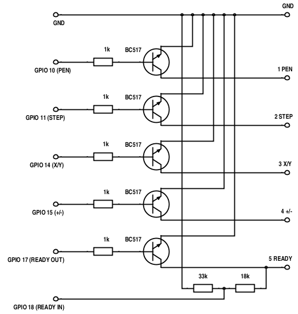

# PlotterController
Program for controlling XY41xx plotters 

## 1 Introduction

The aim of PlotterController project is to develop portable controlling 
program for XY41xx plotters and other small plotters. Project is written 
in C programming language with focus on portability and extensibility.


## 2 Hardware supported

### 2.1 Currently supported hardware

#### 2.1.1 Raspberry PI -> GPIO -> XY41xx
Please note Raspberry PI works with 3.3V whereas XY41xx works with 5V. For this 
reason you cannot conect Raspberry directly to XY41xx (this would destroy 
your Raspberry) - see below. 

#### 2.1.2 Linux PC -> /dev/parportx -> XY41xx
You only need to make sure you have rights for reading from and writing to 
/dev/parportx device.

#### 2.1.3 FreeBSD PC -> /dev/ppix -> XY41xx
Also here you only need to make sure you have rights for reading from and 
writing to /dev/ppix device.

#### 2.1.4 FreeDOS -> LPTx -> XY41xx
This port is tested well with Borland Turbo C 2.01 which is available for free:  
http://edn.embarcadero.com/article/20841

 * use turbo c and file PLOTTER.PRJ located in src directory
 * make sure font1.fnt is present in the same direcroty a PLOTTER.EXE
 * this should be working in any kind of DOS OS

#### 2.1.5 MS Windows -> LPTx -> XY41xx
This port is not tested well. In some versions of Winows OS you need 
additional software (such as userport or porttalk22) for enabling direct access 
to LPTx ports. See following link:
  
http://hw-server.com/parallel-port-lpt-ieee-1284#xp  
http://www.drdobbs.com/184409876  


### 2.2 Currently supported interfaces

#### 2.2.1 Raspberry PI GPIO
Please note Raspberry PI works with 3.3V whereas XY41xx works with 5V. For this 
reason you cannot conect Raspberry to XY41xx directly (this would destroy 
your Raspberry). You will need following transistor interface:  


  
If you have Raspberry verion 1 use following printer creation:  
`PRINTER *prn = pr_create_printer(GPIO, "1");`  
  
In case of Raspberry version 2 use:  
`PRINTER *prn = pr_create_printer(GPIO, "2");`  
   
#### 2.2.2 PC Parallel port
Currently there is available connection through parallel port with 
following configuration:

```
                                PLOTTER
     PC-printer port       XY4131        XY4140        XY4150
bit 2    4 ------------------ 1 ----------- 1 ----------- 1     PEN
bit 3    5 ------------------ 2 ----------- 2 ----------- 2     STEP
bit 1    3 ------------------ 3 ----------- 3 ----------- 3     X/Y
bit 0    2 ------------------ 4 ----------- 4 ----------- 4     +/-
bit 4    6 ------------------ 5 ----------- 5 ----------- 5     READY
GND     18 ------------------ 6 ----------- 6 ----------- 6     GND
```
  
For Linux PC use:  
`PRINTER *prn = pr_create_printer(PARPORT, "/dev/parport0");`  
  
FreeBSD PC use:  
`PRINTER *prn = pr_create_printer(PARPORT, "/dev/ppi0");`  
  
DOS PC use:  
`PRINTER *prn = pr_create_printer(PARPORT, "0x378");`  
  
## 3 Usage

### 3.1 Project build

For build of project follow these steps:

* Download project and extract it into directory PlotterController
* Go into directory (cd PlotterController)
* Run make (it will produce plotter_controller executable file)
* Run plotter_controller and try demos


### 3.2 Programming

Plotter controller works as C library supporting drawing functions.  
  
Example of usage:

```c
#include <stdio.h>
#include "printer.h"
#include "graph.h"
#include "text.h"

int main(int argc, char **argv) {

	PRINTER *prn;
	if ((prn = pr_create_printer(GPIO, "2")) == NULL) {
		fprintf(stderr, "Error: Cannot access port\n");
		return -1;
	}

	pr_init(prn);			/* Initialization */
	POSITION paper = pr_get_max_position(prn);

	xy_vr(prn, paper.x, 0);		/* Vector Relative */
	xy_vr(prn, 0,paper.y);
	xy_vr(prn, -paper.x,0);
	xy_vr(prn, 0,-paper.y);
	xy_vr(prn, paper.x,paper.y);
	xy_mr(prn, 0,-paper.y);		/* Move Relative */
	xy_vr(prn, -paper.x,paper.y);

	xy_set_font_size(8);		/* Set Font Size */
	xy_set_text_angle(M_PI_2);	/* Set Text Orientation */
	xy_ma(prn, paper.x - 100, 100);	/* Move Absolute */
	xy_vs(prn, 7);			/* Velocity Set */
	xy_write(prn, "Hello World!");	/* Draw text */

	xy_hm(prn);			/* Takes pen home */

	pr_close_printer(prn);
	return 0;
}
```

See main.c for more examples.  
See graph.h, text.h and hpgl.h for complete set of available functions.  


## 4 Architecture

In order to be PlotterController well extensible it is layered into following 
logical parts:

```
+---+--------------------+
| 5 | Client program     |
+---+------+------+------+
| 4 | Text | HPGL |      |
+---+------+------+      |
| 3 | Graph              |
+---+--------------------+
| 2 | Printer            |
+---+---------+------+---+
| 1 | Parport | GPIO |...|
+---+---------+------+---+
```

### 4.1 Interface Layer

Interface layer currently implements parallel port and GPIO I/O. It depends on 
Operating System and computer platform used. If you want to add support for 
new interface this layer is right place for it.


### 4.2 Printer Layer

Printer layer implements concrete plotter. If you want to add support for 
another device you should do it at this layer.


### 4.3 Graph Layer

Graph layer implements basic support for graphics drawing. You can implement 
new basic drawing features here such as new graphical primitives, line types
and so on.


### 4.4 Special Graph Layer

This layer implements special graphics modules like support for text drawing,
support for HPGL and so on.


### 4.5 Client program

Client program (or application) works directly with Basic Graphics library and 
with special graphics modules (text, HPGL).

## 5 Youtube

[](http://www.youtube.com/watch?v=rBLfUTozy2g)
  
[](http://www.youtube.com/watch?v=3A5FSUkz8Y8)

## 6 Contact
Project website:	http://xy4150.webstones.cz/  
Author:			jaroslav.beran@gmail.com  
