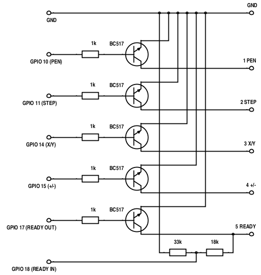

# PlotterController

Ovládací program pro plottery řady XY41xx.

## 1 Obsah
  * [1 Obsah](#1-obsah)
  * [2 Úvod](#2-úvod)
  * [3 Podporovaný hardware](#3-podporovaný-hardware)
    * [3.1 Hardware](#31-hardware)
    * [3.2 Rozhraní](#32-rozhraní)
  * [4 Použití](#4-použití)
    * [4.1 Sestavení programu](#41-sestavení-programu)
    * [4.2 Kreslení HPGL souborů](#42-kreslení-hpgl-souborů)
    * [4.3 Programování](#43-programování)
  * [5 Architektura](#5-architektura)
  * [6 Podpora](#6-podpora)


## 2 Úvod
Cílem projektu PlotterController je vyvinout portovatelný ovládací program
pro plottery řady XY41xx a případně i pro další malé plottery. 

[](http://www.youtube.com/watch?v=rBLfUTozy2g)
  
[](http://www.youtube.com/watch?v=3A5FSUkz8Y8)


## 3 Podporovaný hardware

### 3.1 Hardware

#### 3.1.1 Raspberry PI -> GPIO -> XY41xx
Raspberry PI pracuje s 3.3V zatímco XY41xx používá 5V. Proto není možné
připojit Raspberry PI napřímo s XY41xx - to by Raspberry zničilo. Níže je
popsáno možné propojení.

#### 3.1.2 Linux PC -> /dev/parportx -> XY41xx
Je třeba se jen přesvědčit zda máte oprávnění číst a zapisovat na zařízení 
/dev/parportx. Pokud zařízení /dev/parportx nevidíte, tak zkuste následující:

```
$ sudo modprobe ppdev
```

#### 3.1.3 FreeBSD PC -> /dev/ppix -> XY41xx
Je třeba se jen přesvědčit zda máte oprávnění číst a zapisovat na zařízení 
/dev/ppix.

#### 3.1.4 DOS -> LPTx -> XY41xx
Program byl testován na kompilátoru Borland Turbo C 2.01 který je dostupný zdarma:  
  
http://edn.embarcadero.com/article/20841

 * použijte Turbo C a soubor PLOTTER.PRJ který se nachází v adresáři src
 * ujistěte se že font1.fnt se nachází ve stejném adresáři jako PLOTTER.EXE

#### 3.1.5 MS Windows -> LPTx -> XY41xx
Tato kombinace není dobře otestovaná. V některých verzích Windows je potřeba 
podpůrný software (např userport nebo porttalk22) který umožní přímý přístup 
k LPTx portům. Prozkoumejte následující odkazy:  
  
http://hw-server.com/parallel-port-lpt-ieee-1284#xp  
http://www.drdobbs.com/184409876  


### 3.2 Rozhraní

#### 3.2.1 Raspberry PI GPIO
Raspberry PI pracuje s 3.3V zatímco XY41xx používá 5V. Proto není možné
připojit Raspberry PI napřímo s XY41xx - to by Raspberry zničilo. Budete
tedy potřebovat následující tranzistorový interface:
  

  
Pokud máte Raspberry Pi, Pi Zero, Pi Zero W nebo Compute Module vytvořte 
referenci na printer následujícím způsobem:  
`PRINTER *prn = pr_create_printer(GPIO, "1");`  
  
V případě Raspberry Pi 2, Pi 3 and Compute Module 3 vytvořte referenci 
takto:  
`PRINTER *prn = pr_create_printer(GPIO, "2");`  
   
#### 3.2.2 PC Paralelní port
Je rovněž možné připojit plotter přes paralelní port. V takovém případě 
použijte následující zapojení:

```
                                PLOTTER
     PC-printer port       XY4131        XY4140        XY4150
bit 2    4 ------------------ 1 ----------- 1 ----------- 1     PEN
bit 3    5 ------------------ 2 ----------- 2 ----------- 2     STEP
bit 1    3 ------------------ 3 ----------- 3 ----------- 3     X/Y
bit 0    2 ------------------ 4 ----------- 4 ----------- 4     +/-
bit 4    6 ------------------ 5 ----------- 5 ----------- 5     READY
GND     18 ------------------ 6 ----------- 6 ----------- 6     GND
```
  
Linux PC:  
`PRINTER *prn = pr_create_printer(PARPORT, "/dev/parport0");`  
  
FreeBSD PC:  
`PRINTER *prn = pr_create_printer(PARPORT, "/dev/ppi0");`  
  
DOS PC:  
`PRINTER *prn = pr_create_printer(PARPORT, "0x378");`  
  
## 4 Použití

### 4.1 Sestavení programu

Program sestavíte následujícím způsobem:

  1. Udělejte klon repozitáře `git clone https://github.com/berk76/plottercontroller PlotterController`
  1. Přepněte se to adresáře projektu `cd PlotterController`
  1. Spusťte `make`
  1. Výsledkem kompilace budou následující soubory: `plotter_controller`, `prn_hpgl`
  1. Nyní můžete spustit `plotter_controller` a zkusit demo, nebo můžete vyzkoušet tisk HPGL souborů použitím `prn_hpgl`  

### 4.2 Kreslení HPGL souborů

Použitím `prn_hpgl` programu můžete kreslit HPGL soubory.

```
Usage:
prn_hpgl [-s <scale factor>] -i <interface number> -f <file.hpgl>

Interface numbers available:
(1) Linux PC (/dev/parport0)
(2) FreeBSD PC (/dev/ppi0)
(3) DOS PC (0x378)
(4) Raspberry Pi, Pi Zero, Pi Zero W and Compute Module
(5) Raspberry Pi 2, Pi 3 and Compute Module 3
```

Například - pokud máte plotter připojený k Linuxu přes paralelní port, spusťe program s následujícími parametry:

 ```
 $ ./prn_hpgl -i 1 -f hpgl_examples/kuzeloid.hpgl
 ```

Pokud máte HPGL výkres který je větší nebo menší než kreslící plocha plotteru, tak můžete použít `fit_hpgl` program a velikost výkresu přizpůsobit:

```
Usage:
fit_hpgl [-i] -x <new x size> -y <new y size> -f <file.hpgl>

-i  print info only
-f  input file
-x  new x size
-y  new y size
```

Použitím tohoto programu můžete přizpůsobit velikost HPGL výkresu a uložit výsledek do souboru:

```
$ ./fit_hpgl -x 2500 -y 1750 -f hpgl_examples/kuzeloid.hpgl > saved.hpgl 
```

nebo můžete výstup předat rourou přímo do `prn_hpgl`:

```
$ ./fit_hpgl -x 2500 -y 1750 -f hpgl_examples/kuzeloid.hpgl | ./prn_hpgl -i 1 
```

Více HPGL kreseb můžete nalézt zde: [cygnus.speccy.cz ...](https://cygnus.speccy.cz/popis_printer-aritma0507_2.php) 

### 4.3 Programování

Plotter controller je knihovna funkcí v c-čku.  
  
Příklad použití:

```c
#include <stdio.h>
#include "printer.h"
#include "graph.h"
#include "text.h"

int main(int argc, char **argv) {

	PRINTER *prn;
	if ((prn = pr_create_printer(GPIO, "2")) == NULL) {
		fprintf(stderr, "Error: Cannot access port\n");
		return -1;
	}

	pr_init(prn);			/* Initialization */
	POSITION paper = pr_get_max_position(prn);

	xy_vr(prn, paper.x, 0);		/* Vector Relative */
	xy_vr(prn, 0,paper.y);
	xy_vr(prn, -paper.x,0);
	xy_vr(prn, 0,-paper.y);
	xy_vr(prn, paper.x,paper.y);
	xy_mr(prn, 0,-paper.y);		/* Move Relative */
	xy_vr(prn, -paper.x,paper.y);

	xy_set_font_size(8);		/* Set Font Size */
	xy_set_text_angle(M_PI_2);	/* Set Text Orientation */
	xy_ma(prn, paper.x - 100, 100);	/* Move Absolute */
	xy_vs(prn, 7);			/* Velocity Set */
	xy_write(prn, "Hello World!");	/* Draw text */

	xy_hm(prn);			/* Takes pen home */

	pr_close_printer(prn);
	return 0;
}
```

Pro inspiraci použití prozkoumejte soubor main.c.  
V [API dokumentaci](https://github.com/berk76/plottercontroller/wiki/API) naleznete kompletní seznam funkcí.  


## 5 Architektura

PlotterController má následující architekturu tvořenou pěti vrstvami:

```
+---+--------------------+
| 5 | Client program     |
+---+------+------+------+
| 4 | Text | HPGL |      |
+---+------+------+      |
| 3 | Graph              |
+---+--------------------+
| 2 | Printer            |
+---+---------+------+---+
| 1 | Parport | GPIO |...|
+---+---------+------+---+
```

### 5.1 Interface

Vrstva Interface implementuje paralelní port a GPIO I/O.

### 5.2 Printer

Vrstva Printer implementuje konkrétní plotter.  
[Prozkoumejte API...](https://github.com/berk76/plottercontroller/wiki/API#3-printer)


### 5.3 Graph

Vrstva Graph implementuje podporu základního kreslení.   
[Prozkoumejte API...](https://github.com/berk76/plottercontroller/wiki/API#4-graph)

### 5.4 Special Graph

Tato vrstva implementuje podporu pro kreslení textu nebo pro HPGL příkazy.
[Prozkoumejte API...](https://github.com/berk76/plottercontroller/wiki/API#5-text)

### 5.5 Klientský program

Klienský program/aplikace používá přímo vrstvu pro základní kreslení, 
nebo vrstvu pro speciální grafiku (text, HPGL).

## 6 Podpora

Pokud máte jakékoliv dotazy, nápady nebo připomínky, navštivte [diskuze](https://github.com/berk76/plottercontroller/discussions).
